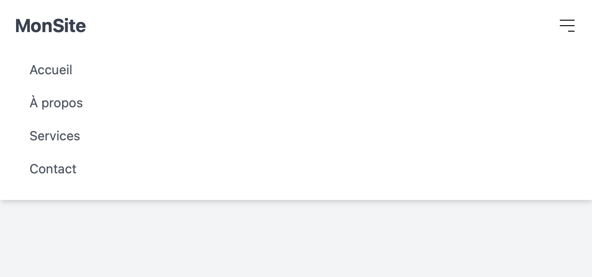

# Navbar Responsive avec Tailwind CSS

Ce projet présente une barre de navigation (Navbar) moderne et épurée, conçue en utilisant Tailwind CSS et Alpine.js. Grâce à cette navbar, vous pouvez offrir à vos utilisateurs une expérience de navigation fluide et adaptée aux différents types d'écrans.

## Fonctionnalités

- **Responsive** : Conçue pour s'adapter à tous les types d'écrans, du mobile au desktop.
- **Menu Burger** : Un bouton de menu burger pour les écrans plus petits qui affiche le menu en cliquant.

## Captures d'écran

## Comment utiliser la Navbar

1. Intégrez le fichier `navbar.html` dans la page de votre choix.
2. Assurez-vous d'inclure le CDN de Tailwind CSS et le script Alpine.js dans l'en-tête de votre page.
3. Si nécessaire, personnalisez les liens et le logo selon les besoins de votre site ou application.

## Personnalisation

Cette navbar a été conçue pour être flexible :

- Modifiez les couleurs, la taille de la police, ou toute autre propriété avec les classes utilitaires de Tailwind CSS.
- Ajoutez ou retirez des liens en fonction des besoins de votre site.
- Ajustez les comportements ou ajouter des animations en modifiant le script Alpine.js intégré.

## Contribuer

Les contributions sont toujours les bienvenues ! Si vous avez des suggestions d'améliorations ou souhaitez ajouter des fonctionnalités supplémentaires à cette navbar, n'hésitez pas à soumettre une demande de tirage (pull request) ou à ouvrir une issue.